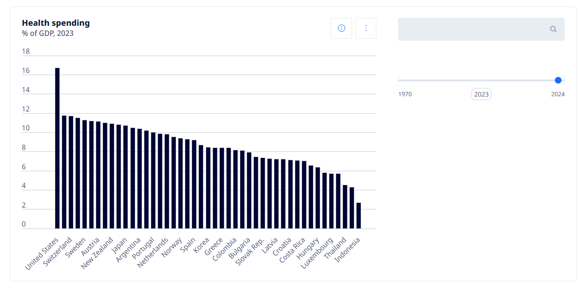
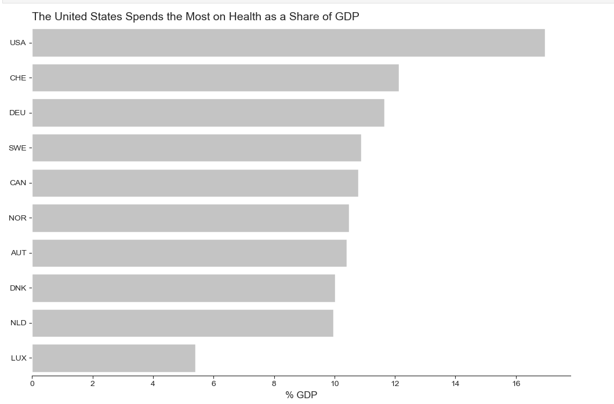
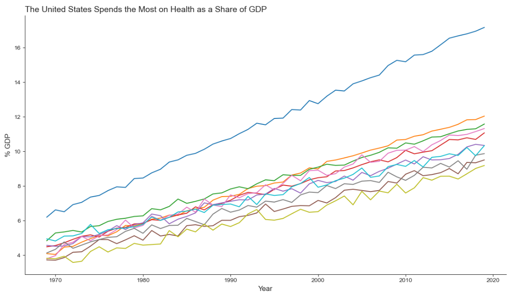
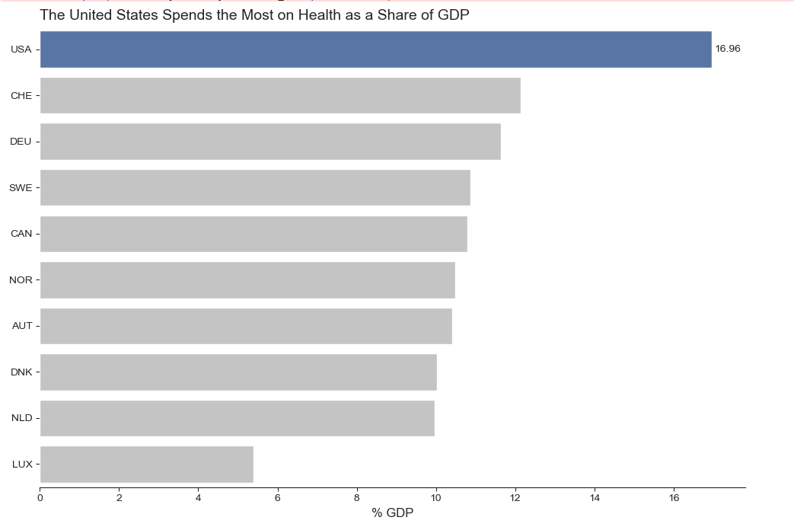
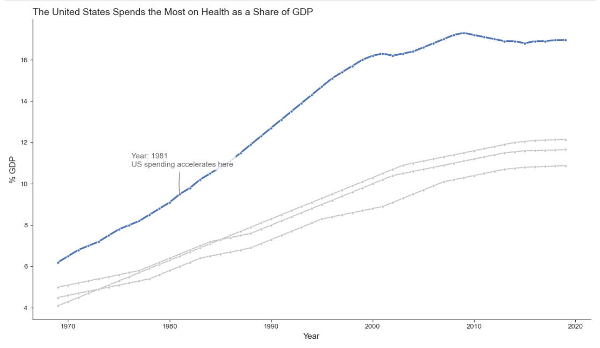

| [home page](https://ssuriyapriya.github.io/Suriyapriya-s-Data-Viz-Portfolio/) | [data viz examples](dataviz-examples) | [critique by design](critique-by-design) | [final project I](final-project-part-one) | [final project II](final-project-part-two) | [final project III](final-project-part-three) |

Source: 

I selected this particular data visualization because it presents a rich, important dataset in a way that is functional but has clear and significant room for improvement. At first glance, the chart successfully shows the total health spending for various countries and gives a basic sense of how that spending is broken down. It is a very common and familiar chart type, which makes it a perfect candidate for a redesign that can demonstrate the principles of effective data visualization.

However, I chose this chart primarily for its weaknesses, as they provide a great opportunity to tell a more compelling story. The original chart fails to guide the viewer's attention. The sorting order is unclear, hiding any meaningful ranking, and all countries are treated with the same visual priority, so nothing stands out. The most significant issue is that by presenting a static view of a single year, the chart completely misses the crucial story of how spending has changed over time. I was inspired by these limitations to explore how a different approach could better highlight the key insights, specifically the dramatic story of the United States as a global outlier in healthcare spending.

**Redesigning Health Spending: From a Static List to a Compelling Story**

This project documents the process of redesigning a data visualization about health spending as a percentage of GDP. The goal was to move beyond a simple comparison and create a visualization that provided deeper context and a clear narrative, following a five-step design process.

**Step 1 & 2: The Original Visualization and Critique**

The process began with a standard vertical bar chart, showing health spending for various countries from 1970-2019.

My initial critique, using Stephen Few's effectiveness profile, revealed several key insights. On the positive side, the chart was clean, used a proper zero-baseline, and was sorted, which made it easy to see the ranking of countries. However, the critique method made its weaknesses glaringly apparent:

1. **Poor Perceptibility:** The vertical orientation forced the country labels to be rotated, making them difficult to read.
2. **Lack of Narrative:** This was the biggest issue. The chart was a static list of facts for a single year. It showed *what* the spending levels were, but offered no context on *how* they got there. It presented data without telling a story.

The main takeaway from the critique was that the most interesting story, the United States as a massive outlier was presented without any historical context. This insight became the driving force behind my redesign.

**Step 3: Sketching a Solution**

To address the lack of narrative, I decided the redesign must show change over time. This immediately led me to the idea of a **line chart**. My goal was to create a visualization that answered the question: "Has the U.S. always been such an outlier?"

My initial wireframe was a quick pen-and-paper sketch. It focused on plotting the spending for the top three countries from the original chart over the last 30 years. The sketch included:
* A strong, declarative title.
* A thicker, uniquely colored line for the United States to make it the focal point.
* A placeholder for an annotation to mark the approximate point where the U.S. trend began to diverge significantly.

This initial plan was simple and focused on transforming the static comparison into a dynamic story.

**Step 4: Testing and User Feedback**

I presented my sketches to a small group of peers to gather feedback before building the final version. I spoke with a student from the MSPPM program and another from a design background. The feedback was invaluable and directly shaped the final product.

**Key Insights from Feedback:**

To test my initial concepts, I sought feedback on my sketches from three peers with diverse backgrounds: a student in the MISM program, one from the MSPPM program, and an MBA student. The feedback was incredibly helpful and validated the overall direction of the redesign.

There was a strong consensus among them: they all found the line chart concept far more compelling than the redesigned bar chart. They noted that while the bar chart was a clean and effective comparison for a single year, the line chart's ability to show the historical trend told a much richer and more impactful story.

Beyond this general agreement, they provided specific, actionable feedback that directly influenced the final design:

The MSPPM student, accustomed to policy briefs, immediately pointed out the need to add a data source. They correctly noted that for the visualization to be credible and trustworthy, the audience must know where the information comes from.

The MBA student was focused on the narrative and suggested I should explicitly pinpoint the moment "where the US began to emerge" as an outlier. They felt that highlighting this key inflection point was crucial to making the story's main takeaway impossible to miss.

This feedback was instrumental. It led to two direct improvements in the final design: the inclusion of a clearly visible source at the bottom of the visualization and making the annotation at 1981 a central, explanatory feature of the line chart.

| Question                                                                                 | Interview 1 | Interview 2 |
|------------------------------------------------------------------------------------------|-------------|-------------|
|  First, just take a look at this sketch. Can you tell me what you think this is showing? | 	"It's a line chart showing health spending as a percentage of GDP over several decades. It compares the United States to a few other countries."            |             |
|  What story or main message do you take away from this chart?                            |             |             |
|  Is there anything here that you find particularly surprising, interesting, or confusing?|             |             |
|  Is there anything you would change or do differently?                                   |             |             |

Synthesis: 

_What patterns in the feedback emerge?  What did you learn from the feedback?  Based on this feedback, come up with what design changes you think might make the most sense in your final redesign._

**Step 5: The Final Redesigned Visualization**

Based on this feedback, my final redesigned visualization, created in Tableau, shows this new, focused story.

<noscript></noscript><object class='tableauViz'  style='display:none;'><param name='host_url' value='https%3A%2F%2Fpublic.tableau.com%2F' /> <param name='embed_code_version' value='3' /> <param name='site_root' value='' /><param name='name' value='HealthSpending_17581588450590&#47;Dashboard1' /><param name='tabs' value='no' /><param name='toolbar' value='yes' /><param name='static_image' value='https:&#47;&#47;public.tableau.com&#47;static&#47;images&#47;He&#47;HealthSpending_17581588450590&#47;Dashboard1&#47;1.png' /> <param name='animate_transition' value='yes' /><param name='display_static_image' value='yes' /><param name='display_spinner' value='yes' /><param name='display_overlay' value='yes' /><param name='display_count' value='yes' /><param name='language' value='en-GB' /><param name='filter' value='publish=yes' /></object>

## The KPIs - The Executive Summary
The three KPI (Key Performance Indicator) boxes at the top serve as the dashboard's "executive summary." They are designed to be read first, providing the most critical, high-level insights instantly. They immediately anchor the viewer with the core message.

**USA 2019 Spending (16.96%):** This is the headline figure. It establishes the primary subject and its magnitude. By placing the most important number first, you ensure that even a viewer who only spends five seconds on the dashboard walks away knowing the core data point.

**Average of Top 6 Nations (10.87%):** This KPI provides essential context. The 16.96% figure is meaningless in isolation. By comparing it to the average of other top-spending nations, you immediately establish a benchmark that proves the U.S. is an outlier. This is a very strong choice because comparing the U.S. to other high spenders makes its position even more extreme than comparing it to a global average.

**Spending Gap: US vs #2 (4.82%):** This KPI quantifies the magnitude of the outlier status. It answers the question, "Just how far ahead is the U.S.?" By pre-calculating the difference between the U.S. and the second-highest country (Switzerland), it removes the cognitive load from the viewer. They don't have to do mental math; it serves them the insight directly. A gap of nearly 5 percentage points is substantial, and this KPI makes that fact undeniable.

## The Bar Chart - Detailed Comparison and Exploration
The horizontal bar chart serves as the detailed evidence for the KPIs. It allows the viewer to move beyond the summary and see the ranked comparison for themselves.

**Strategic Highlighting:** The use of color is a perfect application of a preattentive attribute. The blue for the U.S. and the neutral gray for the other top 10 countries immediately draws the viewer's eye to the main subject. This makes the chart's primary point the U.S. is in first place by a wide margin instantly perceptible.

**Interactivity for Deeper Analysis:** The sliders and filters transform the chart from a static image into an engaging, exploratory tool.

The Year Slider is a fantastic feature that allows users to become data detectives. They can scrub through time to see for themselves how the top 10 rankings have shifted, answering questions like, "Was the U.S. always the top spender?" or "Which countries have seen their spending rise or fall?"

**The Location Filter** adds another layer of customized analysis, allowing a user to isolate specific countries for a direct comparison, creating their own focused view of the data.

## The Line Chart - The Historical Narrative
This is the narrative centerpiece of the dashboard. If the bar chart answers "what," the line chart answers "how and when." It provides the crucial historical context that the other components lack.

By highlighting the U.S. line in blue and keeping the three comparison countries in a muted gray, this avoids the common "spaghetti chart" problem where too many lines become an unreadable mess. This design choice keeps the focus squarely on the main character of the story: the United States.

**The Annotation as a Narrative Signpost:** This is arguably the most powerful element of the entire dashboard. The annotation pointing to 1981 is a perfect example of a narrative signpost. It doesn't just show the data; it guides the viewer's interpretation. By explicitly marking the point where "US spending accelerates," it pinpoints the inciting incident of the story. This ensures that the viewer doesn't miss the key insight, that the U.S. was not always a massive outlier, but that a significant divergence began around a specific point in time. It transforms the chart from a simple data plot into an explanatory, insightful narrative.

Ultimately, this redesign successfully transforms a simple, static list into a compelling and informative narrative that provides crucial historical context. It doesn't just show that U.S. health spending is high; it shows *how and when* it became a global outlier.

**References and Sources**

1. Data Source: The data for this project was sourced from the OECD Health Statistics database, specifically focusing on health expenditure as a percentage of GDP from 1970 to 2019.

2. Python: The initial data exploration and the creation of the "before" charts (the all-gray bar chart and the 10-line "spaghetti" plot) were done using Python with the Matplotlib and Seaborn libraries.

3. Tableau Public: The final, interactive dashboard was designed and built entirely in Tableau Public.

4. For learning and troubleshooting specific features, I referenced the (https://www.geeksforgeeks.org/tableau/tableau-tutorial/) tutorial on GeeksforGeeks to better navigate the software's interface.
