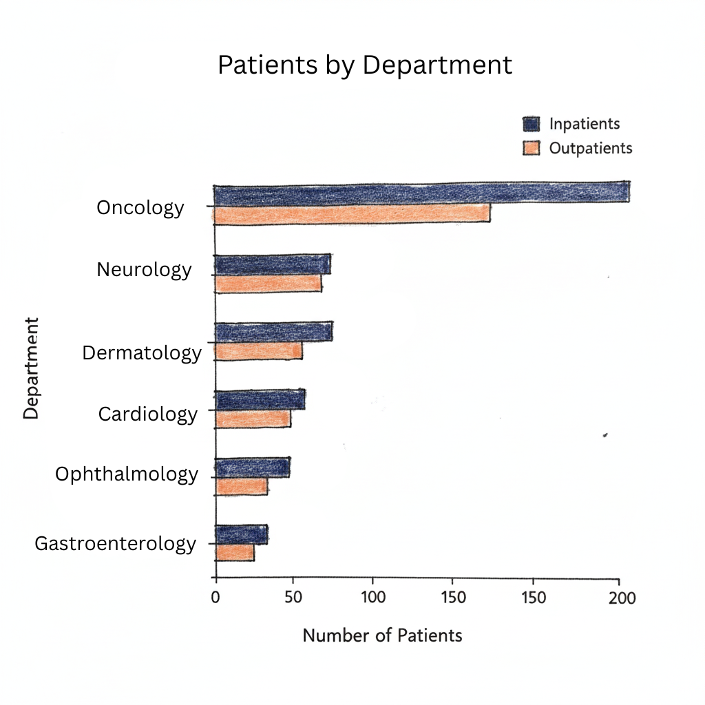
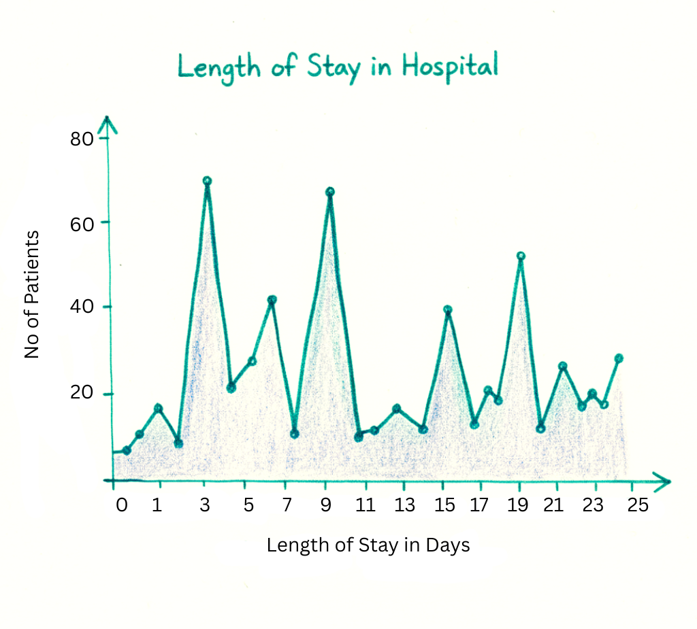

| [home page](https://ssuriyapriya.github.io/Suriyapriya-s-Data-Viz-Portfolio/) | [data viz examples](dataviz-examples) | [critique by design](critique-by-design) | [final project I](final-project-part-one) | [final project II](final-project-part-two) | [final project III](final-project-part-three) |

> Important note: this template includes major elements of Part I, but the instructions on Canvas are the authoritative source.  Make sure to read through the assignment page and review the rubric to confirm you have everything you need before submitting.  When done, delete these instructions before submitting.

# Outline
This project tells a comprehensive data story of the complete patient journey, investigating the critical connection between a hospital's outpatient "front door" and its inpatient operational efficiency. By combining three distinct datasets, we can follow the patient pathway from the initial attempt to schedule an appointment all the way through to their discharge. The central narrative is one of patient flow, identifying key friction points in both accessing and receiving care.

The first part of the story focuses on access to care, using an outpatient dataset to analyze the significant challenge of appointment no-shows. This creates a barrier to entry that delays care and wastes resources. The second part shifts to the efficiency of care, using two inpatient datasets to analyze the Average Length of Stay (ALOS). This uncovers which service lines or diagnoses are keeping patients in the hospital longer, leading to higher costs and bed shortages. The project's core insight lies in connecting these two phases, demonstrating how inefficiencies at the front end can create significant backlogs and challenges for inpatient services, and vice versa.

This story analyzes the end-to-end patient journey to reveal how outpatient appointment no-shows and long inpatient stays create interconnected bottlenecks that hinder hospital efficiency and patient access.

# User Stories:

As a hospital administrator, I want to understand how outpatient clinic performance impacts inpatient bed availability so I can create a more integrated operational strategy.

As an outpatient clinic manager, I want to identify the specific drivers of no-shows so I can implement targeted interventions to improve patient access.

As an inpatient department head, I want to see which diagnoses have the longest length of stay so I can focus on process improvements to increase patient throughput.

# Story Arc: The Full Patient Journey

The story begins at the hospital's "front door", the outpatient clinics. We introduce the high-level challenge of appointment no-shows, framing it as the first major hurdle in the patient journey that prevents timely access to care. The narrative then moves inside the hospital to the inpatient wards. Here, we analyze the Average Length of Stay. The tension builds as we uncover that patients with certain diagnoses are staying significantly longer than others, creating a bed-blocking puzzle that strains hospital capacity. The story's "aha!" moment is the visualization of the complete, interconnected system. A flowchart will show how a high no-show rate for pre-surgical consultations (the outpatient problem) directly contributes to scheduling chaos and inefficient bed use (the inpatient problem). It will also illustrate how long inpatient stays create a backlog of discharged patients who then struggle to book timely follow-up appointments, perpetuating a cycle of poor access. Having identified the key friction points, we propose specific, data-driven solutions for each area—such as a targeted reminder system for high-risk outpatient appointments and a streamlined discharge process for specific inpatient diagnoses. The story concludes with a powerful call to action, urging for a more integrated approach to managing hospital operations, breaking down the silos between outpatient and inpatient services to create a seamless, efficient patient journey from start to finish.

## Initial sketches

# The data
This project synthetically combines three distinct, publicly-available datasets from Kaggle to construct a comprehensive model of a hospital's operations. The first dataset, No Show Appointments, provides the foundation for analyzing the outpatient experience. It contains over 100,000 anonymized records, which will be used to dissect the no-show rate by specialty, appointment type, and other factors. This dataset is critical for understanding the "access to care" portion of the story.

The inpatient narrative is built using two datasets: Hospital Management Dataset and Hospital Admissions Data. Together, these provide detailed information on patient admissions, diagnoses, service lines, and dates of discharge. This allows for a robust analysis of inpatient efficiency, with the Average Length of Stay (ALOS) as the primary metric. Although the patients in these datasets are not the same, they are used to tell a cohesive, conceptual story about how inefficiencies in one part of the patient journey create ripple effects throughout the entire system.

| Name | URL | Description |
|------|-----|-------------|
|  No Show Appointments    | https://www.kaggle.com/datasets/joniarroba/noshowappointments    |      Outpatient data used to analyze appointment no-show rates.       |
|   Hospital Management Dataset   |  https://www.kaggle.com/datasets/kanakbaghel/hospital-management-dataset   |   Inpatient data including service lines and admission/discharge dates.          |
|  Hospital Admissions Data    | https://www.kaggle.com/datasets/ashishsahani/hospital-admissions-data    |    Inpatient data including diagnoses, charges, and length of stay.         |

# Method and medium

The final project will be delivered as a standalone, interactive digital narrative, designed to guide the audience through a cohesive data story. My methodology involves leveraging the specific strengths of Tableau Public for building interactive data visualizations.

My process within Tableau will be to construct a series of worksheets, each telling a part of the patient journey. My workflow for creating each dashboard will be as follows:

Executive Summary with KPI Cards: I will begin by creating four summary KPI (Key Performance Indicator) cards at the top of the dashboard. These cards will provide an immediate, at-a-glance understanding of the most critical metrics, such as the Overall No-Show Rate, Average Length of Stay, Total Patient Admissions, and Average Patient Charges. Each KPI will be created as a separate worksheet.

Building Individual Visualizations: Next, I will create the primary data visualizations in individual worksheets. For example, I will build a line chart to analyze the trend of Average Length of Stay (LoS) over time (e.g., month-by-month). Similarly, the bar chart comparing LoS by diagnosis and the donut chart for no-shows will each be built in their own dedicated worksheets.

Assembling the Dashboard: Once all the individual worksheet components (KPI cards and charts) are complete, I will arrange them into a single, cohesive dashboard. The layout will be intentionally designed to guide the viewer's eye logically through the data—from the high-level KPIs at the top to the more detailed charts below. I will enable dynamic filtering, allowing a user to click on a diagnosis in one chart and see all other charts on the dashboard update in real-time.

## References

1. [Healthcare dashboards example](https://www.gooddata.com/blog/healthcare-dashboards-examples-use-cases-and-benefits/)
